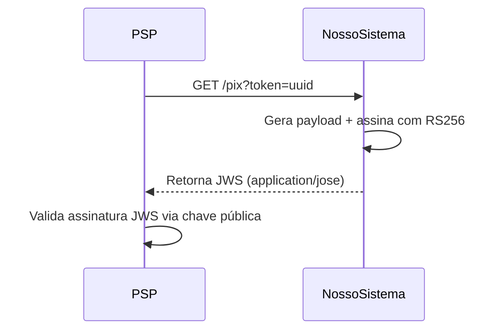

# System Design Doc — POC de Geração e Validação de JWS para QR Code PIX Dinâmico

## 1. Contexto e Problema

O Banco Central do Brasil, por meio da regulamentação do PIX, exige que a consulta de informações de QR Codes dinâmicos seja feita por meio de um endpoint HTTP GET, que deve retornar um payload assinado em formato JWS (JSON Web Signature), utilizando mecanismos compatíveis com a ICP-Brasil para garantir autenticidade e não-repúdio.  
Nosso sistema atualmente não implementa essa camada de assinatura JWS, retornando apenas payloads JSON protegidos por SSL (HTTPS). Para avaliar a viabilidade de adicionar suporte ao JWS, realizamos uma Prova de Conceito (POC).

## 2. Objetivo da POC

- Validar tecnicamente a geração, assinatura e verificação de JWS utilizando PHP com Hyperf/Swoole, mantendo alinhamento com as exigências do BACEN.
- Simular o fluxo real de um PSP consultando um endpoint GET e recebendo um payload JWS assinado.
- Avaliar interoperabilidade (validação cruzada) e facilidade de integração.
- Documentar decisões técnicas e operacionais para embasar a evolução do sistema.

## 3. Requisitos

- Utilizar PHP (Hyperf) com Docker e Swoole, para manter alinhamento com a stack atual.
- Assinar o payload JWS utilizando algoritmo RS256 (RSA + SHA-256).
- Simular uso de chave privada ICP-Brasil (utilizando chave autoassinada para POC).
- Disponibilizar endpoint GET que aceite um token (uuid) e responda com JWS.
- Exemplo de validação do JWS tanto via código quanto via jwt.io.
- Documentação completa do processo e decisões.

## 4. Alternativas Consideradas

| Alternativa                | Prós                                   | Contras                                  |
|----------------------------|----------------------------------------|------------------------------------------|
| PHP + Hyperf + Swoole      | Alinhado à stack, performance, async   | Complexidade extra no setup              |
| PHP puro                   | Simplicidade, menor curva de aprendizado| Menos performático, menos escalável      |
| Node.js / Go               | Ecossistema JWT maduro, exemplos BACEN | Stack diferente, curva de aprendizado    |

**Decisão:** Seguir com PHP + Hyperf + Swoole, para evitar ruptura de stack e facilitar futura evolução para produção.

## 5. Arquitetura da Solução

- **Endpoint GET**: `/pix?token=<uuid>`
- **Assinatura**: RS256, usando chave privada local (em produção: ICP-Brasil).
- **Resposta**: JWS (header/payload conforme BACEN), Content-Type: `application/jose`.
- **Validação**: Script PHP e jwt.io, utilizando chave pública correspondente.

## 6. Resultados do Teste

- **Geração do JWS**: Funcionou conforme esperado, com assinatura RS256.
- **Validação**:  

  - Por script PHP: validação correta usando a chave pública.  
  - Via [jwt.io](https://jwt.io/): validação correta, interoperabilidade comprovada.

- **Desempenho**: Sem problemas de performance identificados na POC.
- **Facilidade de integração**: Libs PHP maduras e integração transparente via Docker.

## 7. Pontos de Atenção

- Para produção, é imprescindível uso de certificado ICP-Brasil e armazenamento seguro das chaves.
- O endpoint precisa seguir fielmente a especificação do BACEN quanto ao formato do payload e headers JWS (ex: inclusão de "x5c", "kid", etc.).
- Revisar mecanismos de rotação das chaves e exposição de certificados públicos.
- Monitorar impacto de performance em ambientes de alta concorrência.

## 8. Conclusão

A POC demonstrou que é tecnicamente viável implementar a geração e validação de JWS para o fluxo de QR Code dinâmico PIX em nossa stack atual.  
O uso de PHP com Hyperf/Swoole mostrou-se eficiente e flexível, e a integração com libs de JWS/JWT foi direta, com exemplos funcionais de geração e validação.  
A decisão de evoluir para produção deve considerar apenas os cuidados de gestão de chaves e aderência total ao padrão BACEN.

## 9. Próximos Passos

- Adaptar a solução para uso de certificado ICP-Brasil real.
- Ajustar estrutura do payload/header conforme manual atualizado do BACEN.
- Implementar rotinas de auditoria e logging para operações de assinatura.
- Realizar testes de carga e integração com PSPs parceiros.